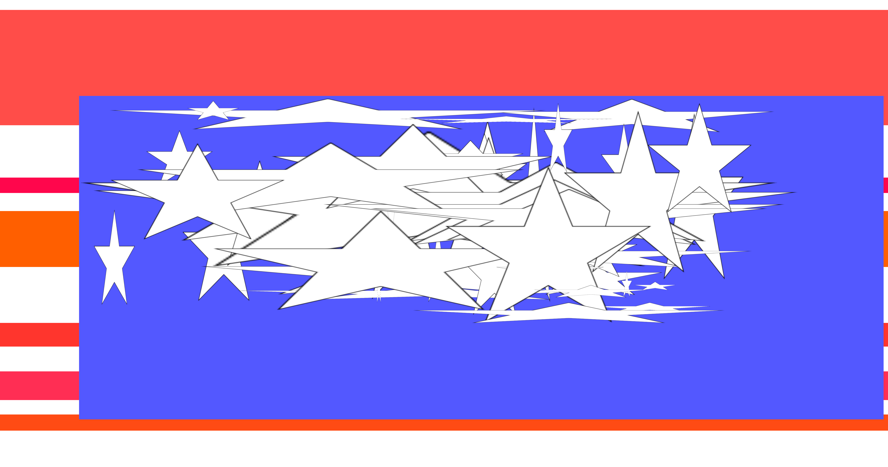

  

# american-flag

generate American flags that abide by US Code, title 4, chapter 1

## building

```
npm run build
```

## usage

```
node ./dist/index.js --count 5
node ./dist/index.js -c 2
```